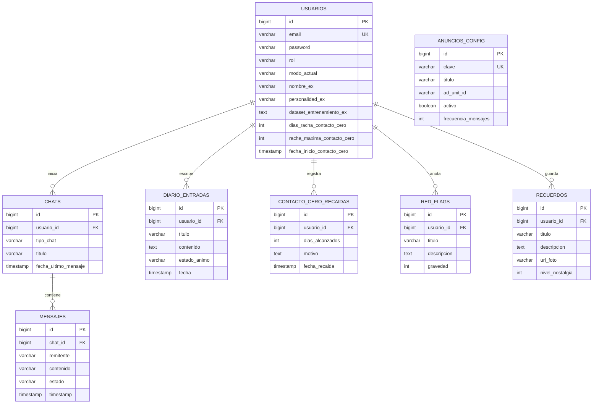

# Contacto Cero & Superación Emocional - Backend API

> **Curso:** CS 2031 Desarrollo Basado en Plataforma (DBP)  
> **Semestre:** 2026-2  
> **Hito:** Semana 7 - Entrega Final del Componente Backend  
> **Integrantes:**  
> - Joel Eulogio (`@eulogio14`) - *Lead Backend & Architecture*  
> - Sandra Carolina Castro Gómez (`@castrogomezsandracarolina`)  
> - Alexis Huamán (`@kato420`)  
> - Marcelo Salinas (`@Marklm500`)  
> - José Ignacio Benalcázar (`@JoseIgnacioBenalcazar`)  

---

## Índice
1. [Introducción](#1-introducción)
   - [1.1 Contexto](#11-contexto)
   - [1.2 Objetivos del Proyecto](#12-objetivos-del-proyecto)
2. [Identificación del Problema o Necesidad](#2-identificación-del-problema-o-necesidad)
   - [2.1 Descripción del Problema](#21-descripción-del-problema)
   - [2.2 Justificación](#22-justificación)
3. [Descripción de la Solución](#3-descripción-de-la-solución)
   - [3.1 Funcionalidades Implementadas](#31-funcionalidades-implementadas)
   - [3.2 Tecnologías y Herramientas](#32-tecnologías-y-herramientas)
4. [Modelo de Entidades y Arquitectura de Datos](#4-modelo-de-entidades-y-arquitectura-de-datos)
   - [4.1 Diagrama Entidad-Relación](#41-diagrama-entidad-relación)
   - [4.2 Descripción de Entidades](#42-descripción-de-entidades)
5. [Manejo de Errores](#5-manejo-de-errores)
   - [5.1 Excepciones Personalizadas](#51-excepciones-personalizadas)
   - [5.2 Global Exception Handler y Códigos HTTP](#52-global-exception-handler-y-códigos-http)
6. [Medidas de Seguridad Implementadas](#6-medidas-de-seguridad-implementadas)
   - [6.1 Autenticación y Autorización JWT](#61-autenticación-y-autorización-jwt)
   - [6.2 Roles y Control de Acceso RBAC](#62-roles-y-control-de-acceso-rbac)
   - [6.3 Prevención de Vulnerabilidades](#63-prevención-de-vulnerabilidades)
7. [Eventos y Asincronía](#7-eventos-y-asincronía)
   - [7.1 Eventos de Dominio con ApplicationEventPublisher](#71-eventos-de-dominio-con-applicationeventpublisher)
   - [7.2 Servicio de Correo HTML con Thymeleaf](#72-servicio-de-correo-html-con-thymeleaf)
8. [GitHub & Management](#8-github--management)
   - [8.1 Gestión de Tareas con GitHub Projects](#81-gestión-de-tareas-con-github-projects)
   - [8.2 Flujo CI/CD con GitHub Actions y Docker](#82-flujo-cicd-con-github-actions-y-docker)
9. [Conclusión](#9-conclusión)
   - [9.1 Logros del Proyecto](#91-logros-del-proyecto)
   - [9.2 Aprendizajes Clave](#92-aprendizajes-clave)
   - [9.3 Trabajo Futuro](#93-trabajo-futuro)
10. [Apéndices y Referencias](#10-apéndices-y-referencias)
    - [10.1 Variables de Entorno](#101-variables-de-entorno)
    - [10.2 Documentación Swagger / OpenAPI](#102-documentación-swagger--openapi)
    - [10.3 Colección de Postman](#103-colección-de-postman)
    - [10.4 Licencia y Referencias](#104-licencia-y-referencias)

---

## 1. Introducción

### 1.1 Contexto
Las rupturas afectivas provocan crisis neurobiológicas y conductuales severas. La omnipresencia de aplicaciones de mensajería instantánea intensifica el impulso de romper el distanciamiento, desembocando en dinámicas perjudiciales de rumiación mental y recaídas. El protocolo psicológico de **"Contacto Cero"** prescribe la supresión de toda comunicación con la expareja para extinguir los refuerzos intermitentes. No obstante, mantener la abstinencia sin soporte estructurado suele fallar durante picos agudos de vulnerabilidad.

### 1.2 Objetivos del Proyecto
* **Objetivo General:** Desarrollar una API REST robusta, segura y escalable en Spring Boot para gestionar el proceso de superación emocional, auditoría de recaídas y contención interactiva asistida por Inteligencia Artificial.
* **Objetivos Específicos:**
  1. Implementar una arquitectura en capas limpia (Controller, Service, Repository) bajo principios SOLID.
  2. Proveer autenticación sin estado mediante JWT con rotación de Refresh Tokens e integración con Google OAuth 2.0.
  3. Implementar un simulador de chat interactivo que replique la personalidad del ex a partir de datasets históricos de chat o brinde contención en Modo Superar.
  4. Desarrollar un sistema de eventos desacoplado (`@EventListener` + `@Async`) para notificaciones automáticas vía correo electrónico HTML renderizado con Thymeleaf.
  5. Asegurar cobertura mediante pruebas unitarias e integración sobre H2 y orquestar el despliegue en contenedores Docker.

---

## 2. Identificación del Problema o Necesidad

### 2.1 Descripción del Problema
Las soluciones digitales existentes se reducen a contadores estáticos o diarios de notas aislados. Carecen de mecanismos de contención reactiva cuando el usuario experimenta impulsos de escribirle a su ex. No proveen análisis de disparadores emocionales ni simulación segura para disipar la urgencia sin consecuencias reales.

### 2.2 Justificación
Un backend especializado centraliza el seguimiento analítico de rachas, cataloga recordatorios conductuales (Red Flags y Recuerdos) y provee un simulador interactivo de descarga emocional. La alternancia entre dos modos de operación (**Modo RECORDAR** para elaborar el duelo y **Modo SUPERAR** para afianzar el desapego) optimiza la respuesta adaptativa del sistema.

---

## 3. Descripción de la Solución

### 3.1 Funcionalidades Implementadas
1. **Autenticación Híbrida y Sesiones:** Registro con contraseñas encriptadas mediante BCrypt, login con access tokens y refresh tokens, y login federado con Google OAuth2.
2. **Simulador de Ex con IA & Ingesta de Chat:** Canal de chat interactivo que emula las respuestas del ex según su personalidad o interviene con directrices psicológicas. Incluye el endpoint `/api/v1/usuarios/ex-dataset` para procesar historiales de chat exportados (WhatsApp/redes), analizando modismos, emojis y tonos predominantes.
3. **Métricas de Contacto Cero y Recaídas:** Cálculo automático de rachas activas, preservación de récords históricos y registro auditable de motivos de recaída.
4. **Diario Emocional Catártico:** Creación y catalogación de entradas reflexivas asociadas a estados anímicos específicos.
5. **Muro de Recuerdos y Red Flags:** Inventario estructurado de memorias con ponderación de nostalgia y catálogo de conductas de advertencia con niveles de gravedad.
6. **Módulo Administrativo:** Endpoints protegidos para auditoría de métricas globales del sistema y gestión dinámica de avisos.

### 3.2 Tecnologías Utilizadas
* **Lenguaje:** Java 21 LTS
* **Framework:** Spring Boot 4.1.x / Spring Data JPA / Spring Security 7
* **Motor de Plantillas:** Thymeleaf
* **Persistencia:** PostgreSQL en Neon (Producción) / H2 In-Memory (Pruebas unitarias)
* **Seguridad:** Auth0 Java-JWT, Google API Client, BCrypt
* **Documentación & Pruebas:** SpringDoc OpenAPI 3 (Swagger UI), MockMvc, JUnit 5, Mockito
* **Infraestructura:** Docker, Docker Compose, Render Cloud Platform

---

## 4. Modelo de Entidades

### 4.1 Diagrama Entidad-Relación



### 4.2 Descripción de Entidades
* **`Usuario`:** Entidad raíz. Almacena credenciales, rol (`ROLE_USER`, `ROLE_ADMIN`), configuración del clon de IA, dataset de modismos aprendidos y métricas de racha.
* **`Chat`:** Sesión conversacional categorizada por `TipoChat` (`CHAT_EX` o `CHAT_APOYO`) vinculada mediante carga perezosa (`LAZY`).
* **`Mensaje`:** Registro de interacciones atómicas con discriminador de `Remitente` (`USUARIO`, `EX_BOT`, `SISTEMA`).
* **`DiarioEntrada`:** Entradas reflexivas con categorización de estados afectivos.
* **`ContactoCeroRecaida`:** Auditoría de quiebres de racha con disparadores reportados.
* **`RedFlag`:** Registro de conductas disfuncionales con escala de gravedad de 1 a 5.
* **`Recuerdo`:** Muro de memoria multimedia con niveles de nostalgia ponderados de 1 a 10.
* **`AnuncioConfig`:** Configuración dinámica de avisos y frecuencias para los clientes frontend.

---

## 5. Manejo de Errores

### 5.1 Excepciones Personalizadas
El sistema define una jerarquía coherente que extiende de una clase base común `BaseAppException`:
* `ResourceNotFoundException` (404 Not Found)
* `DuplicateResourceException` (409 Conflict)
* `BadRequestException` (400 Bad Request)
* `InvalidOperationException` (400 Bad Request)
* `UnauthorizedException` (401 Unauthorized)
* `TokenExpiredException` (401 Unauthorized)
* `ForbiddenException` (403 Forbidden)
* `ExternalServiceException` (502 Bad Gateway)

### 5.2 Global Exception Handler y Códigos HTTP
La clase centralizada `@RestControllerAdvice` (`GlobalExceptionHandler`) intercepta excepciones de negocio y validaciones del framework (`MethodArgumentNotValidException`), emitiendo respuestas estructuradas bajo el formato estándar:

```json
{
  "timestamp": "2026-09-23T16:00:00.000",
  "status": 404,
  "error": "Not Found",
  "message": "Entrada de diario no encontrada con id: 45",
  "path": "/api/v1/diarios/45"
}
```

Códigos HTTP aplicados consistentemente: `200 OK`, `201 CREATED`, `204 NO CONTENT`, `400 BAD REQUEST`, `401 UNAUTHORIZED`, `403 FORBIDDEN`, `404 NOT FOUND`, `409 CONFLICT`, `500 INTERNAL SERVER ERROR`.

---

## 6. Medidas de Seguridad Implementadas

### 6.1 Autenticación y Autorización JWT
* **Arquitectura Stateless:** Sesiones gestionadas exclusivamente mediante tokens criptográficos firmados con HMAC256.
* **Filtro `JwtAuthenticationFilter`:** Intercepta cabeceras `Authorization: Bearer <token>`, valida vigencia y pobla el `SecurityContextHolder`.
* **Tokens de Acceso y Refresh:** Tokens de acceso de vigencia corta (24 horas) y refresh tokens persistentes para renovación segura.
* **Cifrado BCrypt:** Contraseñas hasheadas irreversiblemente con factor de coste de fortaleza industrial.

### 6.2 Roles y Control de Acceso RBAC
Mediante `@EnableMethodSecurity`, el sistema restringe endpoints sensibles con `@PreAuthorize("hasRole('ADMIN')")`. El controlador `AdminController` permite únicamente a usuarios con `ROLE_ADMIN` inspeccionar métricas globales y modificar anuncios del sistema, retornando `403 Forbidden` a usuarios con `ROLE_USER`.

### 6.3 Prevención de Vulnerabilidades
* **Inyección SQL:** Prevenida integralmente mediante consultas parametrizadas y abstracciones de Spring Data JPA.
* **CORS:** Configuración granular habilitando orígenes y cabeceras autorizadas.
* **Validación de Entradas:** DTOs con anotaciones Bean Validation (`@NotBlank`, `@Email`, `@Min`, `@Max`).

---

## 7. Eventos y Asincronía

### 7.1 Eventos de Dominio con ApplicationEventPublisher
Se utiliza el patrón Observer para desacoplar transacciones de negocio de tareas asíncronas:
* **`UsuarioRegistradoEvent`:** Emitido en `AuthService` tras registrar un nuevo usuario.
* **`RecaidaRegistradaEvent`:** Disparado en `ContactoCeroService` al registrarse un quiebre de racha.

### 7.2 Servicio de Correo HTML con Thymeleaf
La clase `AppEventListener` atiende los eventos y delega la ejecución al `EmailService` mediante `@Async("taskExecutor")`. Los correos se construyen mediante el motor `SpringTemplateEngine` de **Thymeleaf**, alimentando plantillas HTML desacopladas (`email-bienvenida.html` y `email-recaida.html`) estilizadas para una presentación moderna y soporte visual de contención.

---

## 8. GitHub & Management

### 8.1 Gestión de Tareas con GitHub Projects
El desarrollo se organizó mediante un tablero Kanban en GitHub Projects estructurado en Backlog, In Progress, Review y Done. Los requerimientos de la Semana 7 se desglosaron en issues asignados con etiquetas descriptivas (`feature`, `security`, `documentation`).

### 8.2 Flujo CI/CD con GitHub Actions y Docker
* **Integración Continua:** Pipeline en `.github/workflows/` que compila el código y ejecuta la suite completa de pruebas unitarias sobre base de datos H2 en cada Pull Request.
* **Despliegue Continuo:** Despliegue automatizado de la imagen Docker en Render ante actualizaciones en la rama `main`, conectándose con la base de datos gestionada en Neon PostgreSQL.

---

## 9. Conclusión

### 9.1 Logros del Proyecto
* Culminación exitosa de los 9 módulos de evaluación establecidos en la rúbrica de DBP Semana 7.
* Integración de 8 entidades JPA completas, 21 DTOs especializados y control de excepciones exhaustivo.
* Suite de pruebas automatizadas verdes ejecutables sin dependencias de red externas.
* Incorporación de la ingesta de datasets de chat inspirada en modelos de clonación conversacional de IA.

### 9.2 Aprendizajes Clave
* El aislamiento estricto de entidades mediante DTOs garantiza la confidencialidad de credenciales y previene ciclos de serialización JSON.
* El procesamiento asíncrono orientado a eventos optimiza los tiempos de respuesta del cliente HTTP en procesos con I/O bloqueante (correos SMTP).
* El uso de bases de datos embebidas (H2) en perfiles de prueba garantiza pipelines de CI reproducibles e independientes de credenciales en la nube.

### 9.3 Trabajo Futuro
1. Implementación de WebSockets (STOMP) para streaming de mensajes en tiempo real en el simulador.
2. Despliegue de un microservicio Python dedicado con PyTorch/FastAPI para inferencia basada en embeddings o fine-tuning de modelos LLM locales.
3. Incorporación de algoritmos de detección de sentimiento en el diario emocional.

---

## 10. Apéndices y Referencias

### 10.1 Variables de Entorno
* `DB_URL`: URL JDBC de PostgreSQL (ej. `jdbc:postgresql://ep-...sa-east-1.aws.neon.tech/neondb?sslmode=require`).
* `DB_USER`: Usuario de base de datos.
* `DB_PASSWORD`: Credencial de acceso a base de datos.
* `JWT_SECRET`: Clave secreta criptográfica HMAC256.
* `PORT`: Puerto de escucha del servidor (por defecto `8080`).

### 10.2 Documentación Swagger / OpenAPI
La documentación interactiva OpenAPI 3 está disponible en el servidor local o desplegado:
* **Swagger UI:** `http://localhost:8080/swagger-ui/index.html` (o `/swagger-ui.html`)
* **OpenAPI JSON:** `http://localhost:8080/v3/api-docs`

### 10.3 Colección de Postman
La colección completa con todos los endpoints requeridos, variables de entorno y scripts de captura automática de tokens JWT se encuentra en la raíz del repositorio: [`postman_collection.json`](./postman_collection.json).

### 10.4 Licencia y Referencias
* **Licencia:** Distribuido bajo **MIT License**.
* **Referencias:**
  1. Vaswani, A., et al. (2017). *Attention Is All You Need*. NeurIPS.
  2. Brown, T., et al. (2020). *Language Models are Few-Shot Learners*. NeurIPS.
  3. Spring Framework & Spring Security Documentation (2026).
  4. JustZando (2026). *Turning my ex girlfriend into an AI because I miss her*. YouTube.